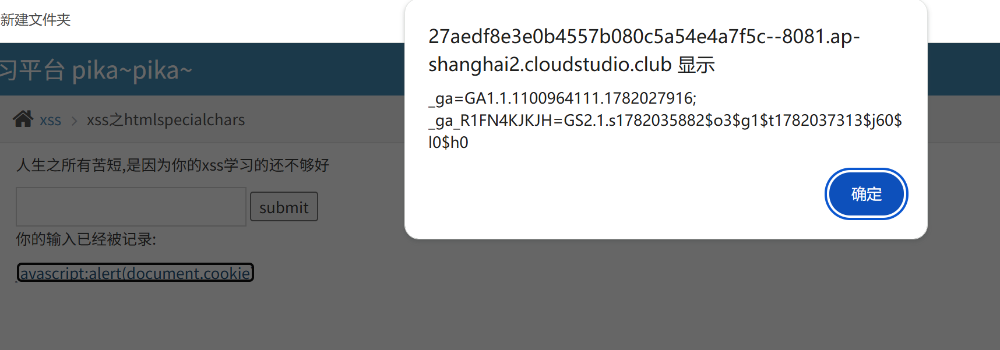

这题和 03 题结构很像，同样是输出到 `<a href="输入">` 里面，但是后端使用了 `htmlspecialchars()` 做 HTML 转义。
默认的`htmlspecialchars()`**只转义：`& < > "`，不会转义单引号 `'`**。

PHP 源码大概：

```
$str = htmlspecialchars($_GET['keyword']);
echo "<a href='$str'>点一下提示~</a>";
```

> 
> 注意：href 属性使用的是**单引号包裹**，htmlspecialchars 默认不会转义单引号，这就是漏洞点。

### htmlspecialchars 参数小知识点

- `htmlspecialchars($input)` 默认模式：只转义 `& < > "`，**不处理单引号 `'`**
- `htmlspecialchars($input,ENT_QUOTES)` 才会同时转义双引号 + 单引号。

## Payload

输入框填入下面 payload：

```
'javascript:alert(1)//
```

输入下面这个，可以弹框
javascript:alert(document.cookie)
