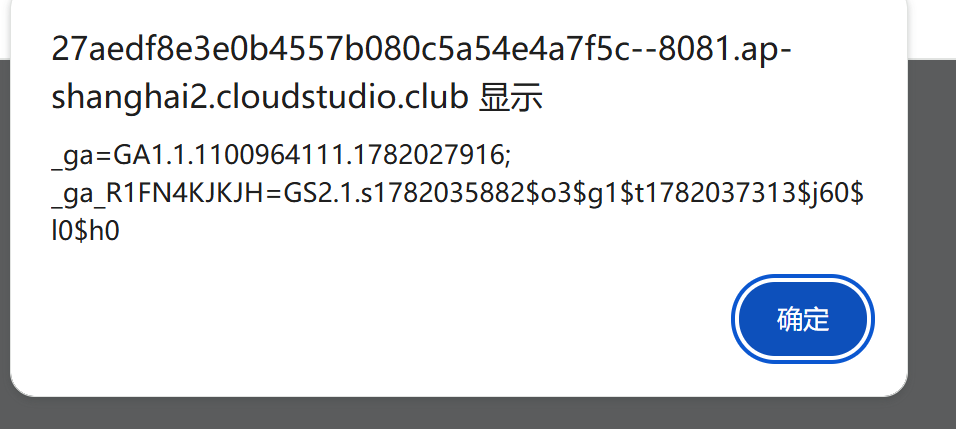

# xss 之 js 输出 xss_04.php 解题

> 
> ⚠️仅本地靶场练习，禁止测试非自己授权的网站。

## 漏洞场景说明

页面标题：`which NBA player do you like?`
**用户输入直接输出到页面的`<script>` JS 代码块内部，不是 HTML 标签里**。
后端代码大概是这样：

```
var player = '你的输入';
```

输入被包在**单引号**JS 字符串里面，不是 html 属性。

> 
> 注意：htmlspecialchars HTML 转义对 JS 上下文无效，这是高频考点。

## 原理

我们需要**闭合 JS 字符串引号**，插入我们的 JS 代码，最后用注释把后面原代码注释掉，避免语法报错。

### payload（直接复制输入框提交）

```
';alert(1);//
```

#### 拼接后页面源码效果

```
var player = '';alert(1);//';
```


