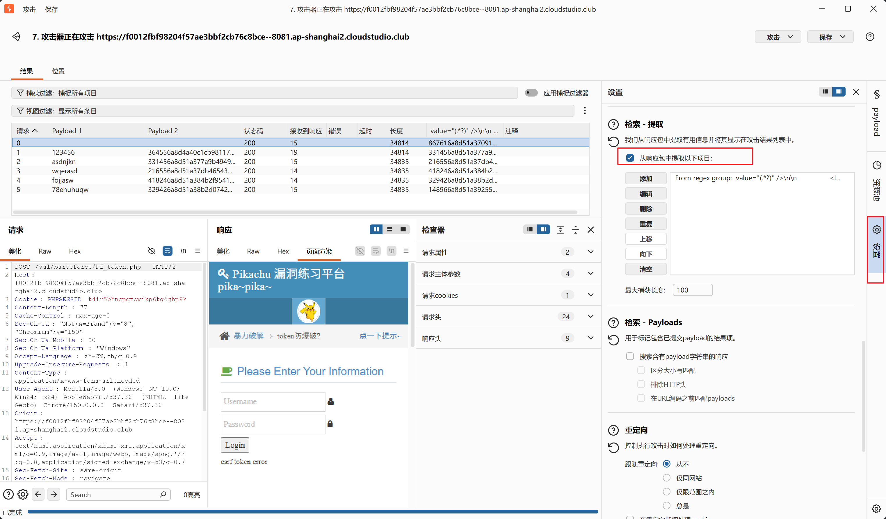

## 漏洞原理

后端生成**一次性 token**，放在表单隐藏域；每次提交登录请求，必须携带这个 token；服务器校验 token 之后直接销毁旧 token，响应页面返回**全新 token**。

> 
> 如果直接重放同一个数据包，会返回 `csrf token error`，旧 token 作废，不能直接爆破。
> 关键点：**新 token 就在 HTTP 响应的 HTML 页面里面**，我们每次发包前，要从上一次响应体提取出新 token，填入下一次请求。

正确账号：`admin`，密码：`123456`

这里可以配置基于页面url提取token
