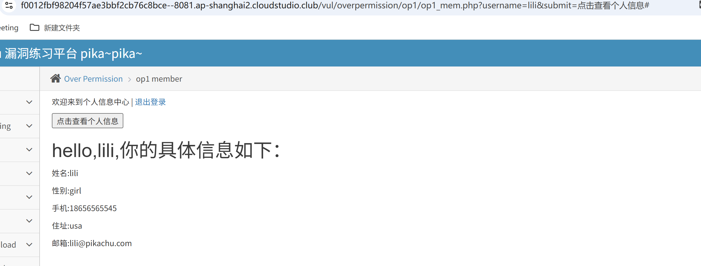

# Pikachu 靶场 op1 水平越权（overpermission）解题CSDN博...

> 
> 关卡：`vul/overpermission/op1/op1_mem.php`，属于**水平越权（横向越权）**，同一权限等级用户越权查看其他人数据CSDN博...。

## 1、账号密码（点一下提示获取）

```
lucy/123456
lili/123456
kobe/123456
```

任选一个账号登录，比如 `lucy / 123456`CSDN博...。

## 2、操作步骤

1. 登录成功进入 op1_mem.php 页面，点击【点击查看个人信息】按钮。
2. 浏览器地址栏 URL 会多出 GET 参数：

```
op1_mem.php?username=lucy&submit=点击查看个人信息
```

此时页面展示 lucy 的个人信息。
3. **漏洞点**：后台只校验 “是否登录”，**没有校验传入的 username 是不是当前登录的 session 用户**，直接拿 url 里的`username`去数据库查询。
4. 修改 URL 里的`username`参数，改成其他用户名，例如：

```
op1_mem.php?username=lili&submit=点击查看个人信息
```

回车，在 lucy 登录会话下，直接读出 lili 的手机号、住址、邮箱，完成水平越权。同理改为`username=kobe`可以读取 kobe 数据。

## 3、漏洞原理（看源码）

```
//只判断是否登录，没有校验传入username是否等于session里的登录用户
if(isset($_GET['submit']) && $_GET['username']!=null){
    $username=escape($link, $_GET['username']);
    $query="select * from member where username='$username'";
    //直接用前端传过来的username查库
}
```

> 
> 错误：信任客户端 GET 传参；
> 正确做法：查询用户信息应该从`$_SESSION`拿当前登录用户名，**不要接收 url 传入的 username**CSDN博...。

## 4、修复方案

1. 查询个人信息时，**使用服务端 session 保存的用户名，拒绝客户端传入 username 参数**；
2. 如果必须接收用户 id / 名字，后台校验传入值与登录 session 身份一致，不一致直接拒绝查询；
3. 禁止把身份标识放在 GET 参数中传递敏感数据查询。

## 5、区分概念

- **水平越权 (op1)**：同权限，A 看 B 的数据（lucy 看 lili）
- **垂直越权 (op2)**：普通用户去做管理员的功能，权限提升。


# ============
实操
正常登入lucy账户
然后直接url里面修改name为其他用户，即可访问其他用户的信息



